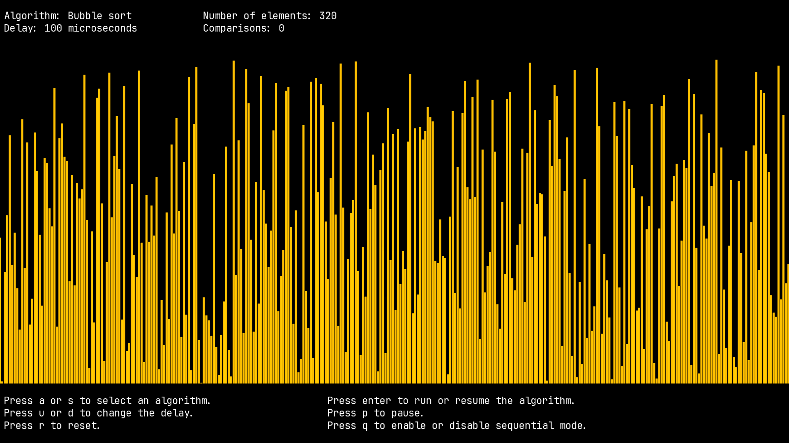
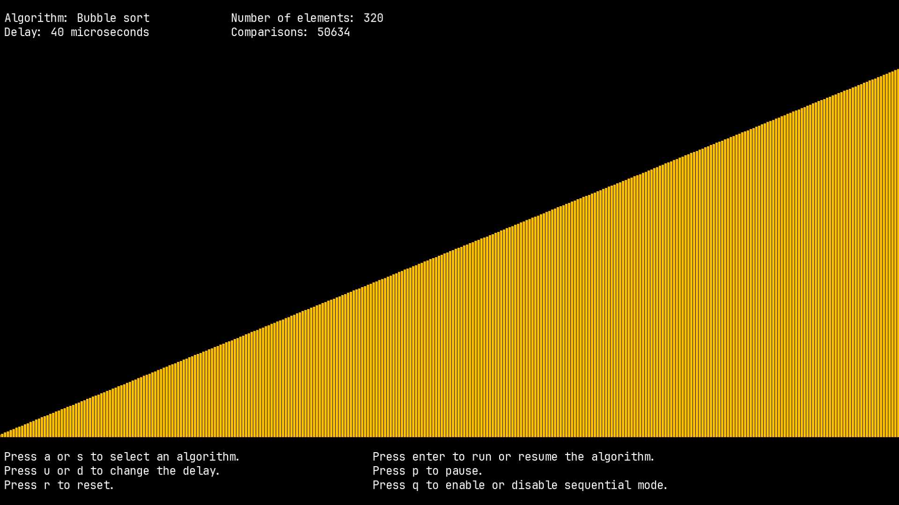

+++
title = 'A sorting algorithms visualiser written in C using OpenGL'
date = 2023-06-16
thumbnail = 'thumbnail-algo-visualiser.png'
draft = false
+++

After seeing [this video](https://www.youtube.com/watch?v=kPRA0W1kECg&t=2s) by
Timo Bingmann I wanted to build my own algorithms visualizer. So, here it is, an
interactive program written in C and using OpenGl, to visualise
some sorting algorithms.

This program allows you to visualize sorting algorithms with adjustable speed. Supported algorithms include bubble sort, selection sort, quick sort, and insertion sort. You can pause the algorithm at any point and enable sequential mode to advance one step at a time with each key press.

You can find more information about building and using this program on my [Github](https://github.com/denniscmartin/algo-animator). I also recorded a [video](https://youtu.be/KvOI88s-FsU) about the development journey.

Here is a short video:

  
<video width=100% controls autoplay>
<source src="video.mp4" type="video/mp4">
Your browser does not support the video tag.  
</video>


