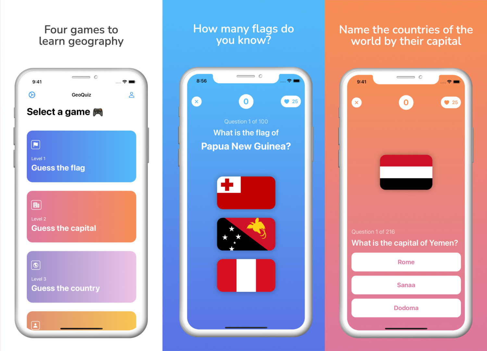
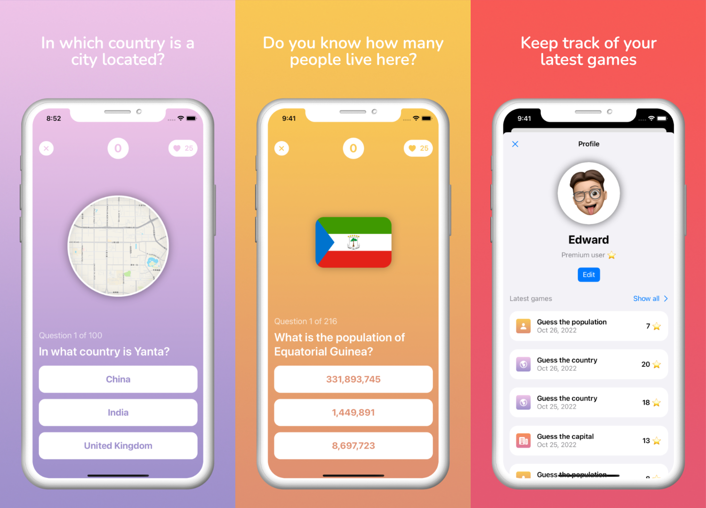
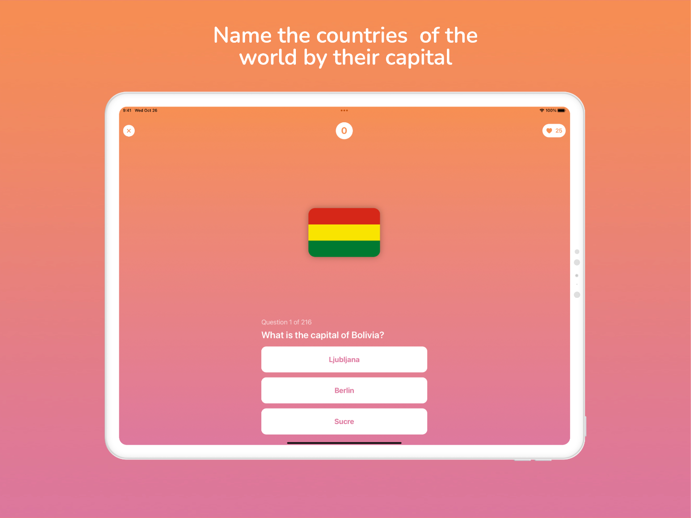

+++
title = 'Geoquiz, a geography game for iOS'
date = 2022-10-23
thumbnail = 'thumbnail-geoquiz.png'
draft = false
+++

Geoquiz is a geography game for iOS written in Swift and SwiftUI. I also implemented
In-App purchases with the help of [RevenueCat](https://revenuecat.com).

Right now it has 70 monthly downloads on average and I'm able to earn some pocket money
from it.

You can download it from the [App Store](https://apple.co/450Y92W) or get the code from
my [Github](https://github.com/denniscmartin/geoquiz-app)

I designed it for iPad too.

