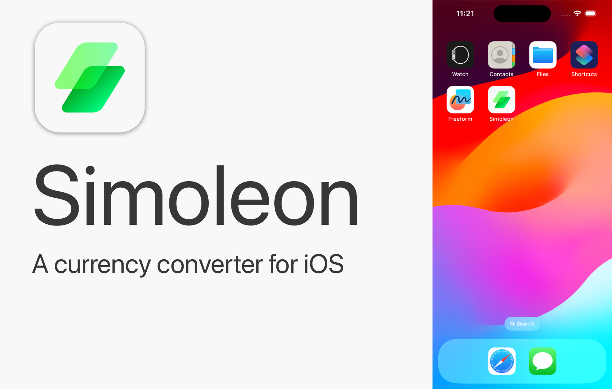
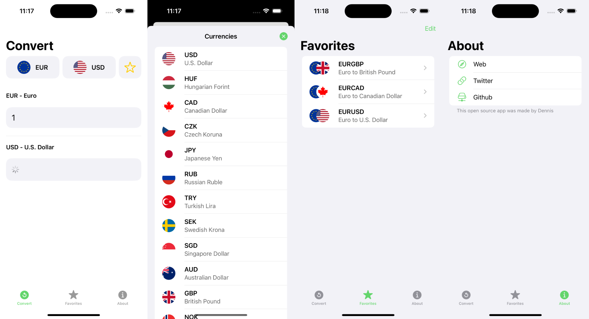

+++
title = 'Simoleon, a currency converter app for iOS'
date = 2024-03-03T11:28:10Z
thumbnail = 'thumbnail-simoleon.png'
draft = false
+++

Simoleon is a currency converter app for iOS. The app itself is written in Swift and 
SwiftUI, and the backend is written in Python using Flask. I use 
[1Forge](https://1forge.com) as my data provider.

It ~~is~~ was published on the App Store. You can find the code in my 
[Github](https://github.com/denniscmartin/simoleon)

