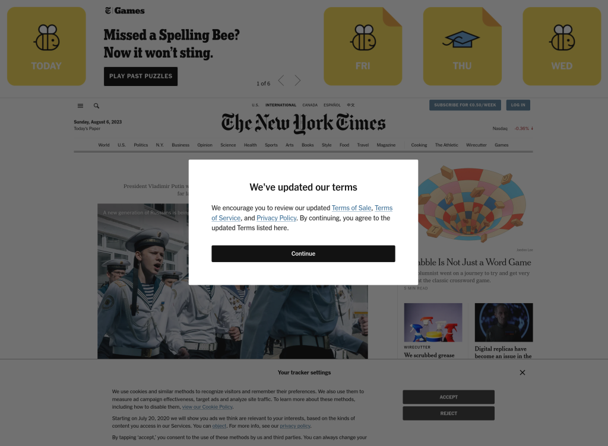

TITLE=Take me back to the 2000s
DESCRIPTION=Take me back to the 2000s
DATE=07/08/2023
+++

Please, git reset and force push the web.

I refuse to accept the shitty current state of the web. Pop
ups, cookies, websites bloated with js, crypto bros selling
you a course about how to get rich, short form content,
tracking, 500 pages privacy terms…I’ve become a grumpy old
man, I know.

Back in the day, the internet was more genuine. Everybody
had their own space to share stuff. Each website had a views
counter and that was cool. When we said “I’m going to
connect to the internet” we really meant it. Now, we are
connected all day.

Anyway, the internet in the 2000s was better.