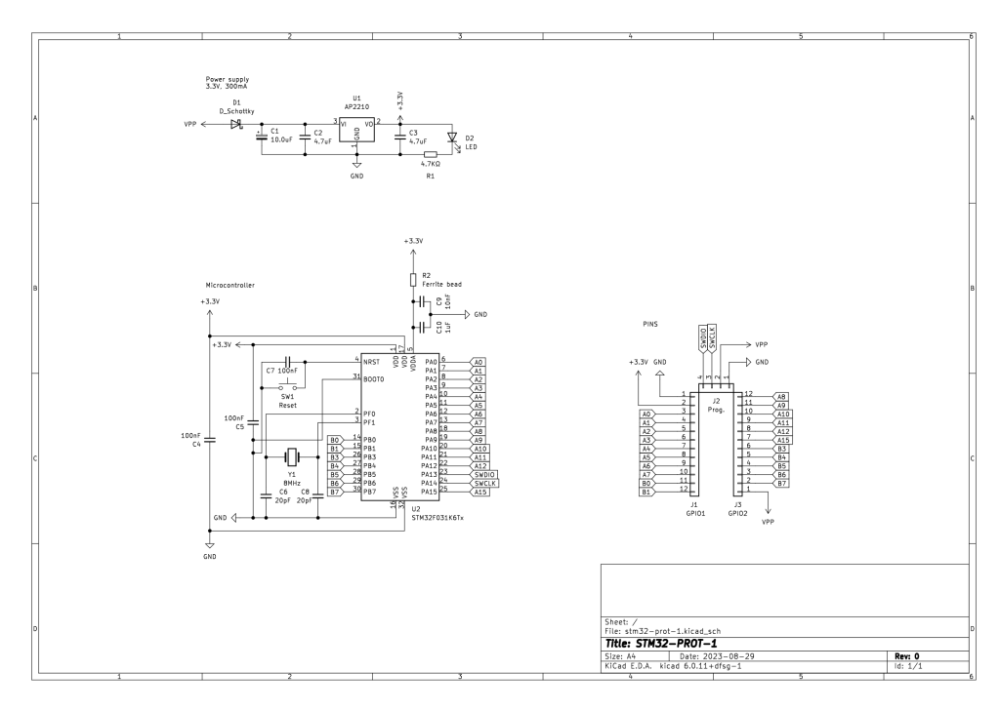

TITLE=My first PCB design
DESCRIPTION=My first PCB design
DATE=14/09/2023
+++
A simple STM32 development board. I followed some tutorials in the internet and managed to build this little thing. I used KiCad and sent the files to PCBWay to produce the board. Probably won’t work but I learnt lots of interesting things about PCB design and electronics.

