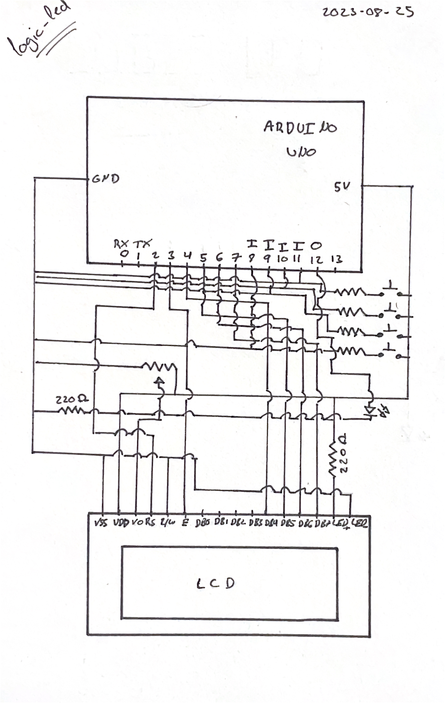

TITLE=Logic gates with an Arduino
DESCRIPTION=Logic gates with an Arduino
DATE=25/08/2023
+++
Code: <https://github.com/denniscmartin/logic-led>

## Schematic

## Controls

Press this button to change the logic gate.

Press this button to select the logic gate shown on the LCD.

These two button are the inputs.

I have selected the AND gate, so If I press both buttons the LED lights up.

There are 7 logic gates to choose from.

